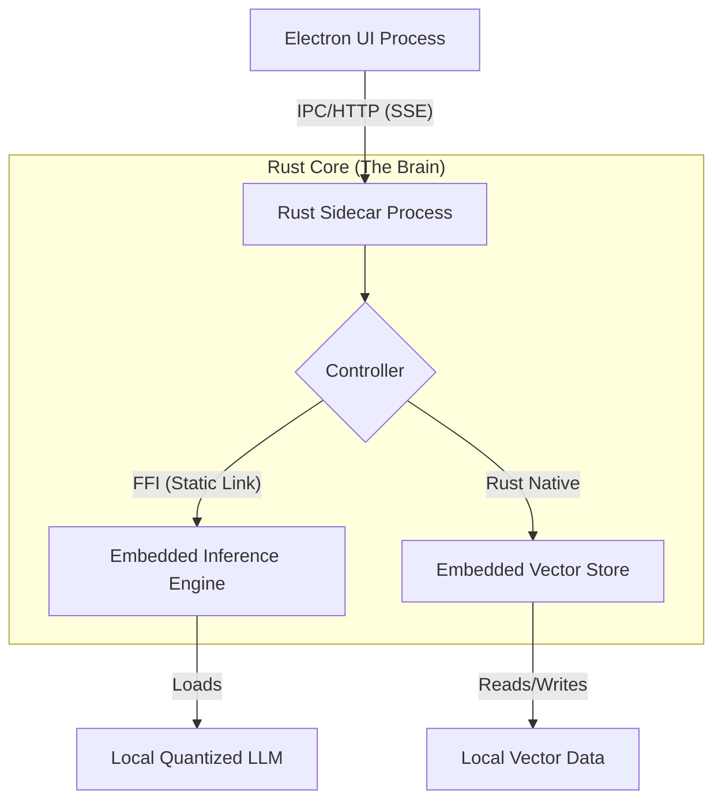

# DocMind

> **An embedded, offline-first enterprise AI knowledge base built for absolute privacy.**

[](LICENSE)
[](https://www.rust-lang.org/)
[](https://www.electronjs.org/)

[**English**](./README.md) | [**简体中文**](./docs/README_CN.md)

---

**DocMind** is a production-ready, offline-first desktop RAG application built with a hybrid Electron + Rust architecture. It features embedded zero-dependency LLM inference for absolute data privacy.

Unlike typical AI prototypes that rely on external API services or complex runtime environments (like Python or Docker), DocMind focuses on **engineering stability and ease of deployment**. By leveraging a system-level hybrid architecture, it delivers commercial-grade performance and a "zero-dependency" user experience.

## ✨ Key Features

* **🔒 100% Air-Gapped Privacy**
  All processing—document OCR, vector embedding, and LLM inference—occurs entirely within a local sandbox process. No data ever leaves the user's machine.

* **📦 Zero-Dependency Distribution**
  Ships as a single, standalone installer (`.exe`/`.dmg`). Users do not need to install Python, Docker, CUDA toolkits, or configure environment variables. It just works.

* **⚡ Native Performance**
  Powered by a Rust backend, achieving millisecond-level "time-to-first-token" latency and efficient memory management for running multi-billion parameter models on consumer hardware.

* **💬 Fluid RAG Experience**
  Supports instant ingestion of PDF/Markdown documents and provides real-time, streaming responses via Server-Sent Events (SSE).

## 🏗️ Technical Architecture

DocMind is built on a high-performance **Hybrid Native Architecture**, separating the UI concerns from heavy computational tasks.


## 🧠 Core Highlights

### 1. **Embedded In-Process Inference**

Instead of relying on external HTTP services for AI compute, DocMind uses Rust FFI (Foreign Function Interface) to statically link highly optimized C++ inference kernels (based on llama.cpp) directly into the application binary.

- Zero-Overhead Calls: Inference happens within the same process memory space, eliminating IPC serialization overhead.
- Precise Lifecycle Management: Direct control over model loading/unloading to manage VRAM usage efficiently.

### 2. Serverless Vector Storage

Integrates LanceDB as an embedded vector search engine. It runs in-process without needing a separate database server and persists data in columnar format directly on the local disk, ensuring fast retrieval with minimal RAM footprint.

## 🛠️ Tech Stack
| Component     | Technology                   | Role                                          |
| ------------- | ---------------------------- | --------------------------------------------- |
| Frontend UI   | Electron, React, TailwindCSS | Modern, responsive desktop interface.         |
| Core Backend  | Rust, Axum, Tokio            | High-concurrency sidecar service.             |
| Inference     | llama-cpp-rs (GGUF)          | Embedded LLM inference via FFI.               |
| Embedding     | fastembed-rs                 | Local vector embedding generation.            |
| Vector Store  | LanceDB                      | Serverless, on-disk vector storage.           |
| Communication | Localhost HTTP + SSE         | Standardized internal communication protocol. |

## 🚀 Getting Started

### Prerequisites

- Rust (Latest Stable)
- Node.js & Pnpm
- C++ Build Tools (Visual Studio on Windows, Xcode Command Line Tools on macOS)

### Installation

1. Clone the repository

   ```bash
   git clone https://github.com/MuzzyLip/DocMind.git
   cd DocMind
   ```

2. Setup Core (Rust)

   ```Bash
   cd core
   cargo build --release
   ```

3. Setup UI (Electron)

   ```bash
   cd ../app
   pnpm install
   pnpm dev
   ```

##  📄 License

This project is licensed under the MIT License - see the LICENSE file for details.
