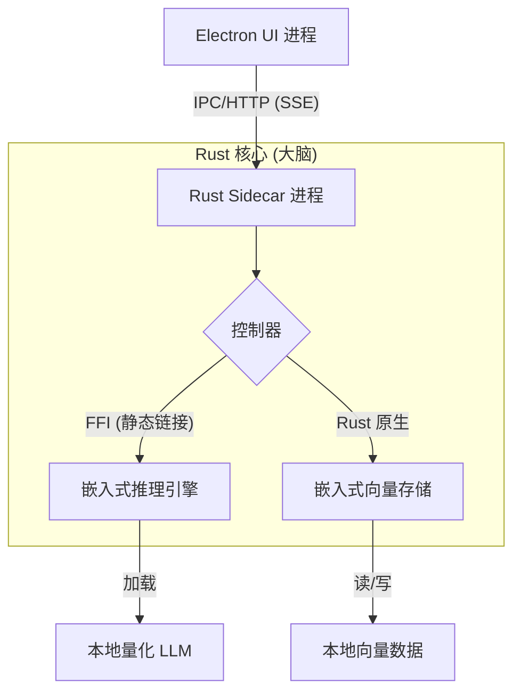

# DocMind

> **一款内嵌式的、离线优先的企业级 AI 知识库，专为绝对隐私而生。**

[](LICENSE)
[](https://www.rust-lang.org/)
[](https://www.electronjs.org/)

[**English**](../README.md) | [**简体中文**](./README_CN.md)

---

**DocMind** 是一款基于混合Electron+Rust混合架构构建的、可投入生产环境使用的离线优先桌面RAG应用。其内置零依赖大型语言模型推理功能，确保绝对数据隐私。

不同于依赖外部 API 服务或复杂运行时环境（如 Python 或 Docker）的常见 AI 原型，DocMind 专注于解决**工程稳定性与部署难题**。通过采用系统级的混合架构设计，它提供了商业软件级别的性能表现和“零依赖”的用户体验。

## ✨ 核心特性

* **🔒 100% 物理隔绝隐私**
  所有处理环节——包括文档解析、向量嵌入和 LLM 推理——均完全在本地沙箱进程中完成。任何数据都不会离开用户的机器。

* **📦 零依赖分发**
  以单一的独立安装包（`.exe`/`.dmg`）交付。用户无需安装 Python、Docker、CUDA 工具包或配置环境变量，实现“开箱即用”。

* **⚡ 原生级性能**
  由 Rust 后端驱动，实现毫秒级的“首字延迟”响应，并通过高效的内存管理在消费级硬件上运行数十亿参数的大模型。

* **💬 流畅的 RAG 体验**
  支持 PDF/Markdown 文档的即时摄取，并通过服务器发送事件 (SSE) 提供实时的流式对话响应。

## 🏗️ 技术架构

DocMind 基于高性能的 **混合原生架构 (Hybrid Native Architecture)** 构建，将 UI 交互与繁重的计算任务分离。


## 🧠 核心亮点

### 1. 嵌入式进程内推理

DocMind 不依赖外部 HTTP 服务进行 AI 计算，而是利用 **Rust FFI (外部函数接口)** 技术，将高度优化的 C++ 推理内核（基于 llama.cpp）直接静态链接到应用程序二进制文件中。

- **零开销调用:** 推理过程在同一进程内存空间内完成，消除了进程间通信 (IPC) 的序列化开销。
- **精确生命周期管理:** 直接控制模型的加载与卸载，高效管理显存占用。

### 2. 无服务器向量存储

集成 **LanceDB** 作为嵌入式向量搜索引擎。它在进程内运行，无需启动单独的数据库服务，并将数据以列式存储格式直接持久化于本地磁盘，确保在极低内存占用下实现快速检索。

## 🛠️ 技术栈

| 模块     | 技术选型                     | 作用                             |
| -------- | ---------------------------- | -------------------------------- |
| 前端 UI  | Electron, React, TailwindCSS | 现代化的桌面交互界面。           |
| 核心后端 | Rust, Axum, Tokio            | 高并发的 Sidecar 服务进程。      |
| 推理引擎 | llama-cpp-rs (GGUF)          | 通过 FFI 实现的嵌入式 LLM 推理。 |
| 向量化   | fastembed-rs                 | 本地向量嵌入生成。               |
| 向量存储 | LanceDB                      | 无服务器的磁盘级向量存储。       |
| 内部通信 | Localhost HTTP + SSE         | 标准化的内部通信协议。           |

## 🚀 快速开始

### 前置要求

- Rust (最新稳定版)
- Node.js & Pnpm
- C++ 编译工具 (Windows 需 Visual Studio, macOS 需 Xcode Command Line Tools)

### 安装步骤

1. **克隆仓库**

   ```bash
   git clone https://github.com/MuzzyLip/DocMind.git
   cd DocMind
   ```

2. **编译核心(Rust)**

   ```bash
   cd core
   cargo build --release
   ```

3. **启动应用 (Electron)**

   ```bash
   cd ../app
   pnpm install
   pnpm dev
   ```

## 📄 许可证

本项目采用 MIT 许可证 - 详情请参阅 LICENSE 文件。
